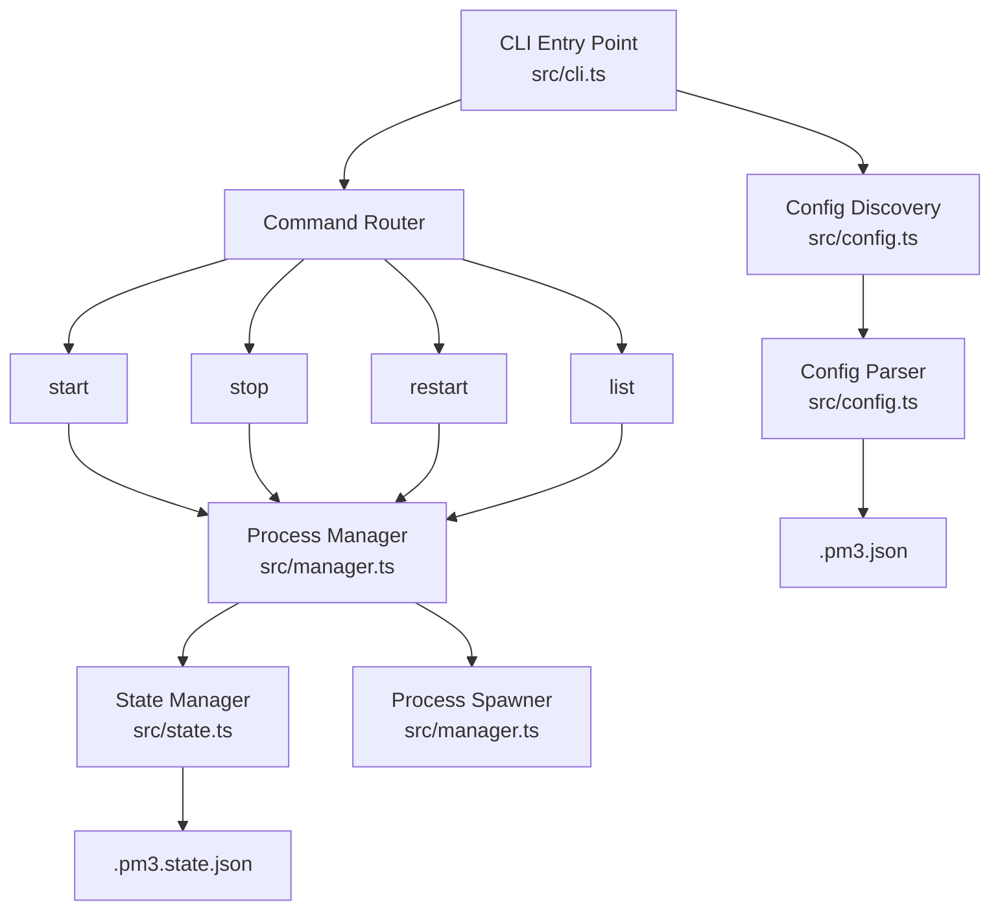

# Design Document

## Overview

pm3 is a standalone CLI tool written in Node.js (TypeScript) that manages local processes based on a `.pm3.json` configuration file. It uses no background daemon — each invocation reads config, validates state, performs the requested action, and exits. Process tracking is persisted via a `.pm3.state.json` file alongside the config.

## Architecture



### Modular Design Principles
- **Single File Responsibility**: CLI parsing, config discovery/parsing, process management, and state persistence are each in their own module
- **No daemon**: Every command is a direct, short-lived CLI invocation
- **State validation on every call**: PIDs are checked against the OS before any action

## Components and Interfaces

### Component 1: CLI Entry Point (`src/cli.ts`)
- **Purpose:** Parse command-line arguments and dispatch to the appropriate command handler
- **Interfaces:**
  - `commandStart(name?: string): Promise<void>` — start all or a specific app
  - `commandStop(name?: string): Promise<void>` — stop all or a specific app
  - `commandRestart(name?: string): Promise<void>` — restart all or a specific app
  - `commandList(): void` — list all apps and their status
  - Supports: `pm3 start [name]`, `pm3 stop [name]`, `pm3 restart [name]`, `pm3 list`
- **Dependencies:** Config module, Process Manager module
- **Library:** Uses `yargs` for command-line parsing and help generation
- **Convention:** Each yargs command delegates to a dedicated `command<Name>` handler function. Yargs command definitions stay thin — all logic lives in the extracted handlers.

### Component 2: Config Discovery & Parser (`src/config.ts`)
- **Purpose:** Find `.pm3.json` by walking up directories; parse and validate it
- **Interfaces:**
  ```typescript
  interface AppConfig {
    name: string;
    script: string;
    cwd?: string;
    args?: string;
  }

  interface Pm3Config {
    apps: AppConfig[];
  }

  interface ResolvedConfig {
    configDir: string;       // absolute path to dir containing .pm3.json
    apps: ResolvedAppConfig[];
  }

  interface ResolvedAppConfig {
    name: string;
    script: string;          // absolute path (resolved: configDir + cwd + script)
    cwd: string;             // absolute path (resolved: configDir + cwd)
    args: string;              // args string passed to the process
  }

  function discoverConfig(startDir?: string): ResolvedConfig;
  ```
- **Dependencies:** Node.js `fs`, `path`
- **Behavior:**
  - Starts from `startDir` (defaults to `process.cwd()`), checks for `.pm3.json`, walks parent directories until root
  - `cwd` is resolved relative to the config file's directory
  - `script` is resolved relative to the resolved `cwd`
  - `args` is stored as a string and passed directly to the spawned process
  - Validates required fields (`name`, `script`); skips invalid entries with a warning
  - Warns on duplicate `name` values, keeps first occurrence

### Component 3: State Manager (`src/state.ts`)
- **Purpose:** Persist and retrieve process state (PIDs, status) across CLI invocations
- **Interfaces:**
  ```typescript
  interface AppState {
    name: string;
    pid: number | null;
    status: 'running' | 'stopped';
    startedAt: string | null;  // ISO timestamp
  }

  interface Pm3State {
    apps: Record<string, AppState>;
  }

  function loadState(configDir: string): Pm3State;
  function saveState(configDir: string, state: Pm3State): void;
  function isProcessRunning(pid: number): boolean;
  function validateState(state: Pm3State): Pm3State;  // checks all PIDs, marks dead ones as stopped
  ```
- **Dependencies:** Node.js `fs`, `path`, `process` (for `kill(pid, 0)` check)
- **State file location:** `.pm3.state.json` in the same directory as `.pm3.json`
- **Behavior:**
  - `loadState`: Reads state file; returns empty state if missing or corrupted
  - `saveState`: Writes state file atomically (write to temp, rename)
  - `isProcessRunning`: Uses `process.kill(pid, 0)` to check if PID exists (signal 0 = no kill, just check)
  - `validateState`: Iterates all entries, marks any with dead PIDs as `stopped`

### Component 4: Process Manager (`src/manager.ts`)
- **Purpose:** Start, stop, restart processes; orchestrate state updates
- **Interfaces:**
  ```typescript
  function startApp(app: ResolvedAppConfig, state: Pm3State): Pm3State;
  function stopApp(name: string, state: Pm3State): Promise<Pm3State>;
  function restartApp(app: ResolvedAppConfig, state: Pm3State): Promise<Pm3State>;
  function listApps(config: ResolvedConfig, state: Pm3State): void;
  ```
- **Dependencies:** State Manager, Node.js `child_process` (`spawn`), `process`
- **Behavior:**
  - `startApp`: Checks if already running (skip if so). Spawns process with `child_process.spawn` using `{ detached: true, stdio: 'ignore' }` and `unref()` so the CLI can exit. Stores PID in state.
  - `stopApp`: Sends `SIGTERM`. Waits up to 5 seconds. If still alive, sends `SIGKILL`. Updates state to stopped.
  - `restartApp`: Calls `stopApp` (if running) then `startApp`.
  - `listApps`: Prints a table with name, status, PID, and uptime for all configured apps.

## Data Models

### .pm3.json (Config File)
```json
{
  "apps": [
    {
      "name": "executor-api",
      "cwd": "./ts/apps/backend/workflow-executor-api",
      "script": "./dist/index.js"
    },
    {
      "name": "integration-service",
      "cwd": "./ts/apps/backend/integration-service",
      "script": "./dist/main.js",
      "args": "run"
    }
  ]
}
```

### .pm3.state.json (State File)
```json
{
  "apps": {
    "executor-api": {
      "name": "executor-api",
      "pid": 12345,
      "status": "running",
      "startedAt": "2026-02-26T10:00:00.000Z"
    },
    "integration-service": {
      "name": "integration-service",
      "pid": null,
      "status": "stopped",
      "startedAt": null
    }
  }
}
```

## Error Handling

### Error Scenarios

1. **No config file found**
   - **Handling:** Print error: "No .pm3.json found in current directory or any parent directory"
   - **User Impact:** CLI exits with code 1

2. **Invalid JSON in config**
   - **Handling:** Print error with parse details
   - **User Impact:** CLI exits with code 1

3. **App entry missing required fields**
   - **Handling:** Print warning, skip that entry, continue with valid entries
   - **User Impact:** Sees warning but other apps still work

4. **Process fails to start (e.g., script not found)**
   - **Handling:** Catch spawn error, print error message with script path
   - **User Impact:** Other apps still start; failed app shown as stopped

5. **State file corrupted**
   - **Handling:** Discard corrupted state, start fresh
   - **User Impact:** Previously running processes become untracked (user may need to manually stop them)

6. **Stop targets a non-existent app name**
   - **Handling:** Print error: "App 'name' not found in config"
   - **User Impact:** CLI exits with code 1

## Project Structure

```
pm3/
├── package.json
├── tsconfig.json
├── src/
│   ├── cli.ts              # Entry point, arg parsing, command dispatch
│   ├── config.ts           # Config discovery and parsing
│   ├── state.ts            # State file management and PID validation
│   └── manager.ts  # Process lifecycle (start/stop/restart/list)
└── dist/                   # Compiled output
```

## Technology Choices

- **Language:** TypeScript (compiled to JS via `tsc`)
- **Runtime:** Node.js (>= 18)
- **Dependencies:** `yargs` for CLI parsing; otherwise uses only Node.js built-ins (`fs`, `path`, `child_process`, `process`)
- **Build:** `tsc` with ES modules
- **Binary entry:** `bin` field in `package.json` pointing to `dist/cli.js`

## Testing Strategy

### Integration Testing
- Full CLI flow: create temp config, run `pm3 start`, verify state file, run `pm3 list`, run `pm3 stop`
- Restart flow: start, restart, verify new PID

### End-to-End Testing
- Use a simple Node.js script as the test process
- Verify actual process spawning, PID tracking, and termination
